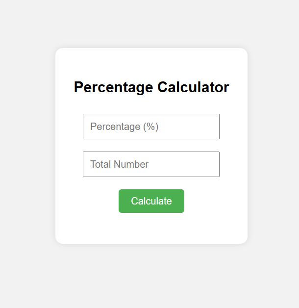

# 📊 Percentage Calculator

A simple and clean percentage calculator built using **HTML**, **CSS**, and **JavaScript**. Easily calculate the percentage value of any number with an intuitive and responsive interface.

---

## 🖥️ Live Preview

> [Live Demo](https://mdanassaifi.github.io/PERCENTAGE-CL/)

---

## 📸 Screenshot

---

## 🚀 Features

- ✅ Calculate any percentage of a number
- ✅ Simple and intuitive UI
- ✅ Responsive design (works on desktop & mobile)
- ✅ Built with pure HTML, CSS & JavaScript (no libraries)

---

## 🧠 How It Works

1. Enter a percentage value (e.g., 20).
2. Enter the total number (e.g., 150).
3. Click the **Calculate** button.
4. Output will show: _20% of 150 is 30_.

---

